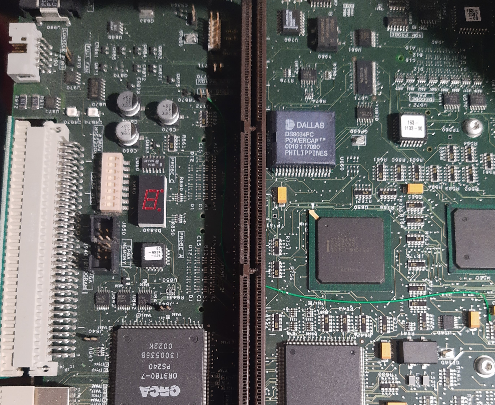
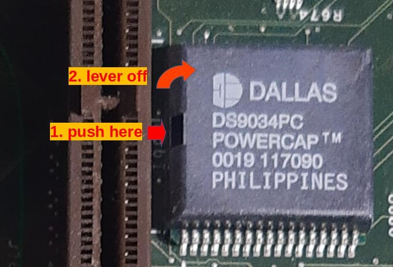
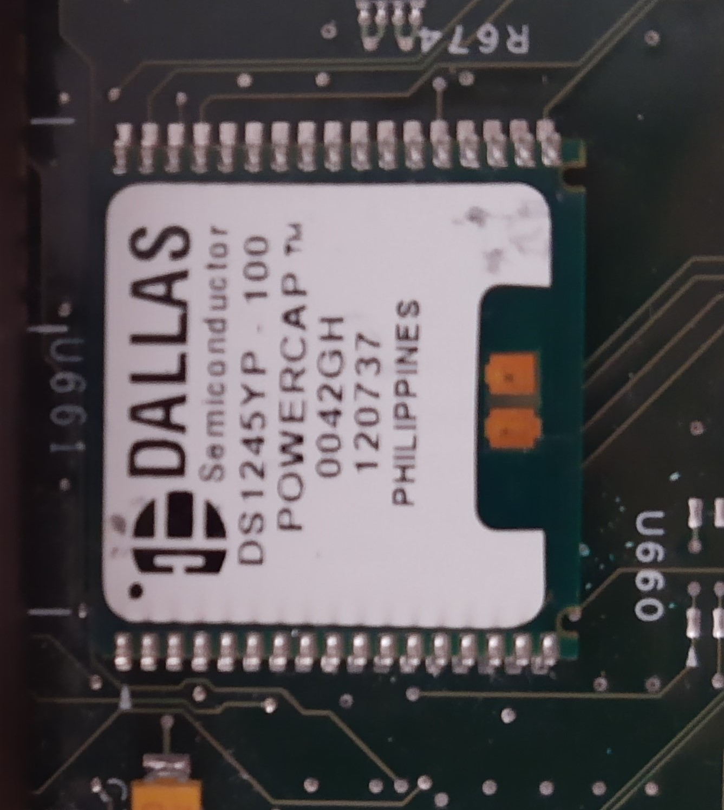
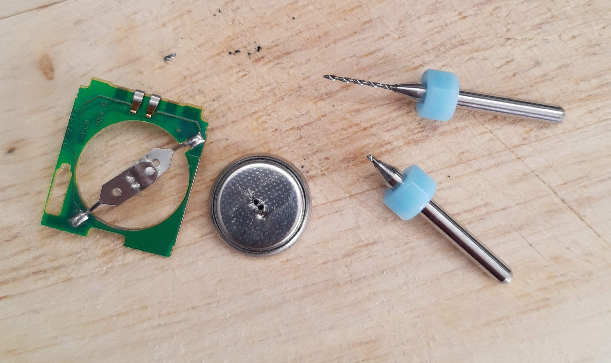
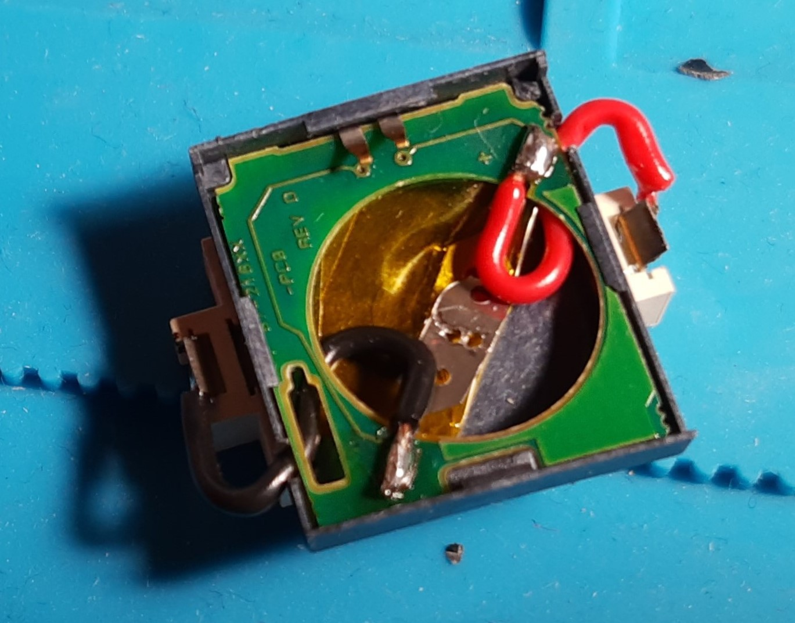
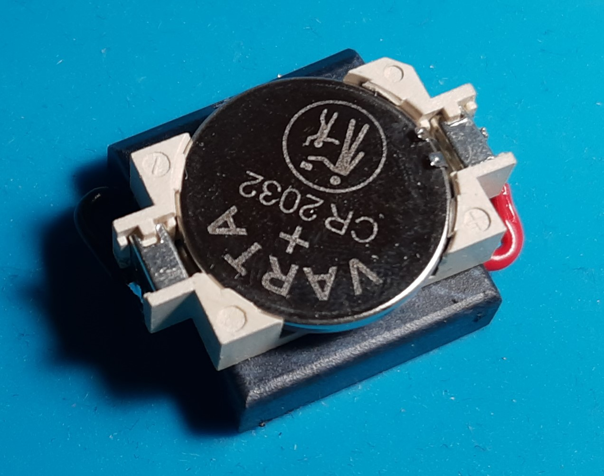
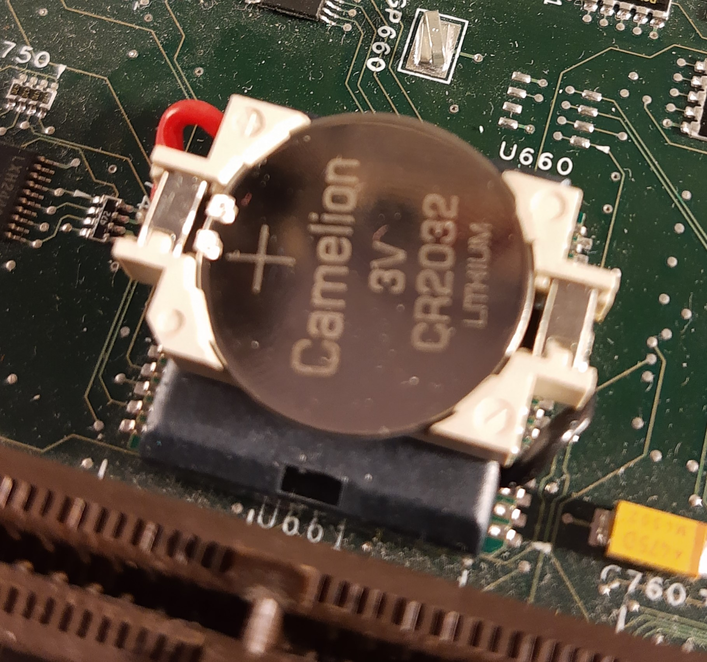
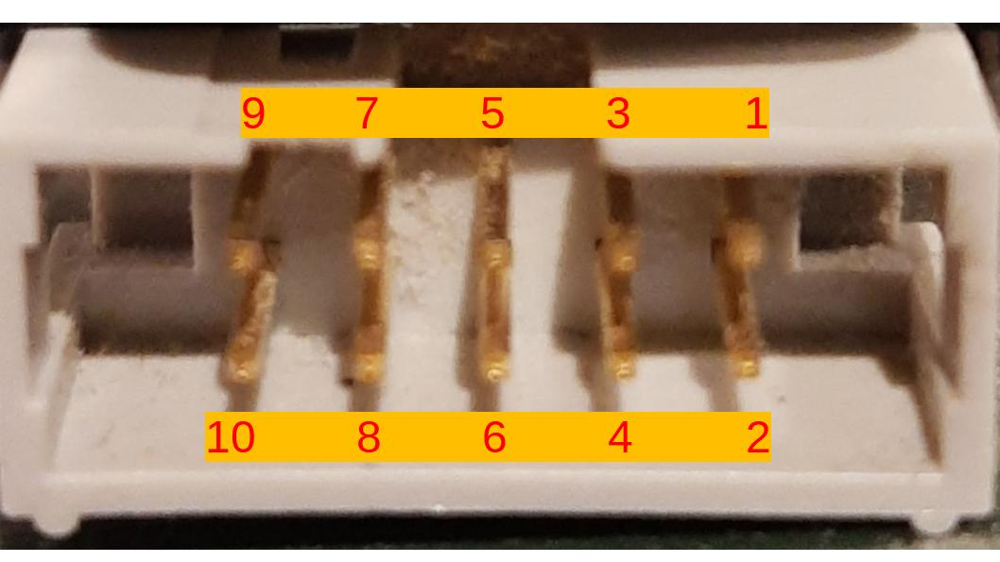
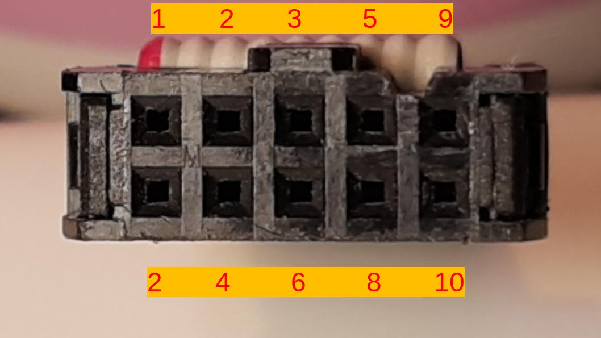
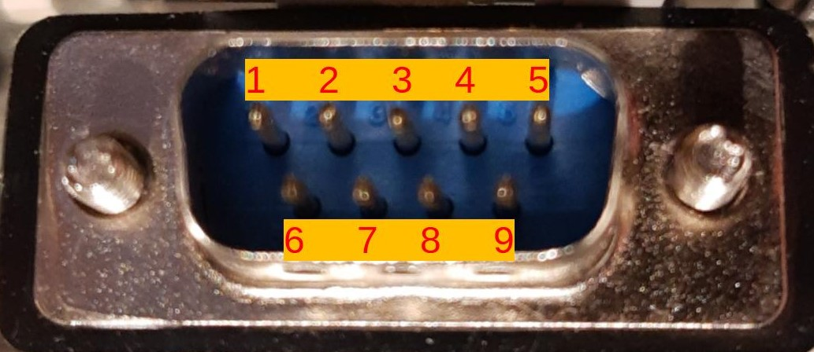

# Replacing the Backup Battery and restoring NVRAM Settings when the Battery has run empty

If your scope is stuck on the splash screen of the TekScope application (see screenshot below), the most likely reason is that the memory contents of the NVRAM have been erased. Usually this is the case when the backup battery of said NVRAM located on the  the PowerPC Board (the lower of the two motherboards) has been depleted. This means that you have to replace the battery and restore the NVRAM settings.

 
the TekScope application splash screen

# Replacing the Battery

Since the Power modules from Dallas aren't available any more I modified the existing one for easier battery replacement in the future.

### 1. Removing the PowerCap module from the NVRAM

   

   Push a small screwdriver into the slit on the side of the PowerCap module and lever it off. You do __not__ need a lot of force for that.  

    

### 2. Removing the old battery

   The tabs are spot welded to the button cell. In my case they felt like they were very firmly attached to the battery I just drilled out the spot welds with a 1mm tungsten carbide drill bit and a Dremel. After that I was able to take out the battery.

   

### 3. Attaching a battery holder to the PowerCap module

   I glued a CR2032 holder to the top of the module and soldered wires between the battery holder and the PCB on the underside. I had to cut small slits into the sides of the plastic housing to be able to route the wires properly. Otherwise the module won't clip back onto the NVRAM. I also used some tape to insulate the old battery tabs in order to avoid short circuits.

    

### 4. Putting the Power module back on top of the NVRAM

   Just hook the module onto the NVRAM chip on the opposite side of the slit and push it down until it latches. Be careful to not bend the contacts in the wrong direction.  

   

# Restoring the NVRAM Settings

### 1. Get yourself a PC with a serial interface ot a USB to serial interface

### 2. Connect the scope to the serial interface

You can use a standard 10-pin IDC to DB9 adapter. __Notice that there are two types that are wired up differently.__ The one that is required here is the older style (DTK/INTEL style). The new style (AT/EVEREX style) is not suitable for our task.  If you are using such an adapter, please make sure that the pinout matches the one in the table below.  If you do not have an adapter at hand connect, just use a couple of jumper wires. This works just as well. The absolute minimum of lines you'd have to connect are __`RX`__, __`TX`__ and __`GND`__.

#### The Pinout of the IDC connector is as follows

male IDC connector on a TDS7104:  
 

female IDC connector on a IDC-serial adapter:  
 

| 10 pin IDC (TDS7000/adapter)|signal|description |
|--|--|--|
|1|DCD|Data Carrier Detect|
|2|DSR|Data Set Ready|
|3|RX|Receive Data|
|4|RTS|Request to Send|
|5|TX|Transmit Data|
|6|CTS|Clear to Send|
|7|DTR|Data Terminal Ready|
|8|RI|Ring Indicator|
|9|GND|System Ground|
|10|not connected|---|

#### The pinout of a standard male serial port (the type you find on a PC) is as follows

|PIN male DB9 (serial)|signal|
| -- | -- |
|1|DCD|
|2|RX|
|3|TX|
|4|DTR|
|5|GND|
|6|DSR|
|7|RTS|
|8|CTS|
|9|RI|

### 3. Connect to the serial interface with a terminal software of your liking.  

* I used [Tera Term](https://osdn.net/projects/ttssh2/releases/). Tera Term should come with the correct serial port settings out of the box. If you want to check, you can find the settings under `Setup` -> `Serial Port...`.  
* For Linux I often use [CuteCom](http://cutecom.sourceforge.net/) if I want something with a graphical user interface.
*  I usually use [HTerm](https://www.der-hammer.info/ages/terminal.html) but for some reason the communication didn't work properly after sending a random character to interrupt the boot process.  

The required settings for the serial interface are:

|setting|value|
|--|--|
|baud rate|9600|
|data bits|8|
|stop bits|1|
|parity|none|
|flow control|no|

#### Please note that you need to reinstall the upper main board again. Otherwise the scope will not turn on.

1. Start your terminal software and connect to the serial port. After that start your scope.
2. When the countdown appears send any character to interrupt the startup process.
3. Send `?` to display the main menu.

### 4. Set the settings to their proper values:

In the main menu send `c` to get into the configuration dialog.
The following table shows the right settings for a TDS7104 other models may require other settings but I would expect them to be the same.

| setting name | value |
| -- | -- |
| boot device |sm|
| processor number |0|
| host name |host|
| file name |c:/vxBoot/vxWorks.st|
| inet on ethernet (e) |192.168.0.2:ffffff00|
| inet on backplane (b) |192.168.0.0:ffffff00|
| host inet (h) |192.168.0.1|
| gateway inet (g) |192.168.0.2|
| user (u) | anonymous |
| ftp password (pw) |anonymous|
| flags (f) |0x1000|
| target name (tn) |tds7000|
| startup script (s) |c:/vxBoot/topScript.hw|
| other (o) |nvfs=0x1000|

Go through the list and enter the right values. Send `.` to clear options that have wrong values set and enter the options menu again after you are through to set the option. Go through the menu one last time to make sure everything is set correctly.

When you're done send an `@` to continue booting the scope when the scope software splash screen is already showing. Otherwise switch the scope off, make sure that Windows boots correctly and turn it back on again. The scope software should now start without a problem.

## Troubleshooting

* If you have trouble using the menu properly because the menu always seems to skip every other option, try changing the line break characters, your terminal software sends after pressing enter. If it is set to send __`\r`__ (carriage return) __AND__ __`\n`__ (line feed) try instead using ___only one or the other___.
