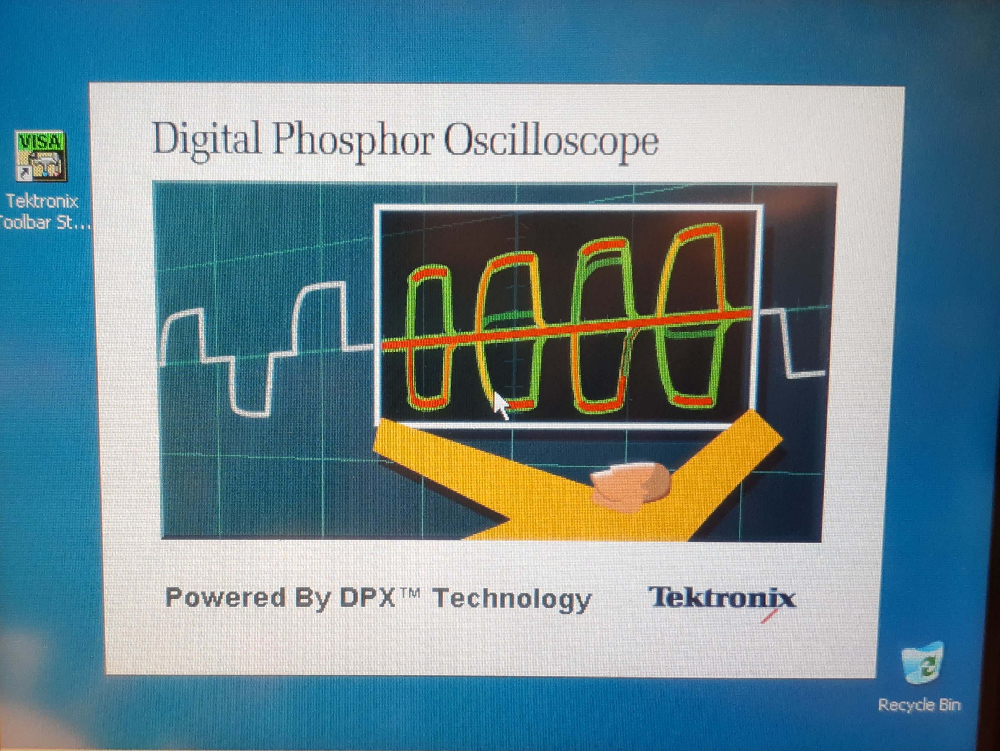

# Tektronix TDS7000/CSA7000

## Various guides and files for maintaining and repairing the Tektronix TDS7000/CSA7000 oscilloscope series

There's still a lot to do and I will be adding bits and pieces from time to time when I find a minute or two. 

## You are very welcome to contribute by either creating pull or feature requests or, starting discussions or simpy sending me messages.  

## Replacing the Backup Battery and restoring NVRAM Settings

If your scope is stuck on the splash screen of the TekScope application (see screenshot below), the most likely reason is that the memory contents of the NVRAM have been erased. Usually this is the case when the backup battery of said NVRAM located on the  the PowerPC Board (the lower of the two motherboards) has been depleted. This means that you have to replace the battery and restore the NVRAM setting. 

I've compiled a tutorial on how to do that here: [Replacing the Backup Battery and restoring NVRAM Settings](NVRAM/README.md)

 
the TekScope application splash screen

I also created a bracket for installing 2.5" SSDs and HDDs: [3D printable SSD holder](3D%20printable%20SSD%20holder)

 
